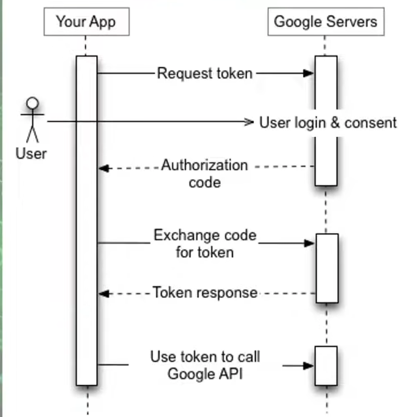
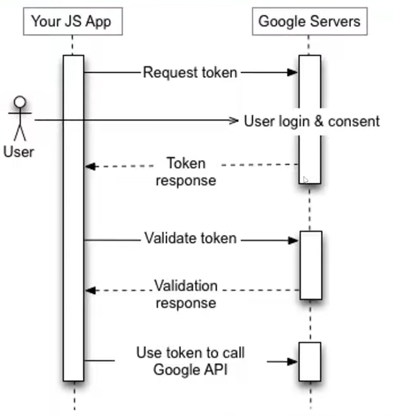
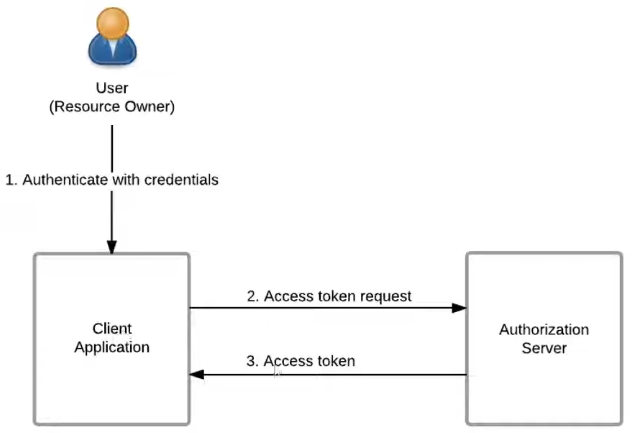
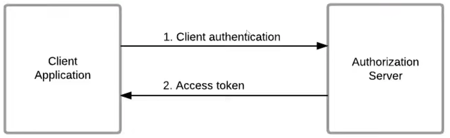

# 🔑 Grant Type trong OAuth 2.0

## 1. Grant Type là gì?

Trong OAuth 2.0, **Grant Type** là cách mà một ứng dụng (client) có thể **nhận Access Token** từ Authorization Server.
Mỗi grant type phù hợp với một tình huống (ứng dụng web, SPA, mobile, server-to-server,…).

## 2. Các loại Grant Type chính

### 2.1 Authorization Code Grant (khuyến nghị, thường dùng kèm PKCE)



**Flow:**

```
[User] → mở ứng dụng (Client)
   |
   v
[Client] → Redirect user tới Authorization Server (AuthZ Server)
   |
   v
User login & consent
   |
   v
Auth Server trả Authorization Code về Client (qua URL)
   |
   v
[Client Backend] → gửi Authorization Code + Client Secret → Auth Server
   |
   v
Auth Server trả Access Token (và Refresh Token)
   |
   v
[Client] → dùng Access Token để gọi Resource Server (API)
```

✅ **Ưu điểm:** An toàn, phổ biến, hỗ trợ Refresh Token.
👉 **Dùng cho:** Web app, SPA, mobile app.

---

### 2.2 Implicit Grant (đã lỗi thời, ít dùng)

  
**FLow:**

```
[Client SPA] → redirect user tới Auth Server
   |
   v
User login & consent
   |
   v
AuthZ Server trả Access Token trực tiếp qua URL Fragment (#access_token=...)
   |
   v
[Client SPA] lấy Access Token → gọi Resource Server
```

⚠️ **Nhược điểm:** Token nằm trong URL, dễ bị lộ. Không có Refresh Token.
👉 **Trạng thái:** Hầu như đã bỏ, thay bằng **Authorization Code + PKCE**.

### 2.3 Resource Owner Password Credentials (ROPC)



**FLow:**

```
[User] nhập username/password vào Client
   |
   v
[Client App] gửi username/password + client_id/secret → Auth Server
   |
   v
Auth Server trả Access Token (và Refresh Token)
   |
   v
[Client] dùng Access Token gọi Resource Server
```

⚠️ **Nhược điểm:**

- User phải đưa password cho Client → nguy cơ lộ.
- Yêu cầu giữa App và Resource có độ trust cao (username/pass cần giống nhau giữ 2 ứng dụng - Thường cần nằm trong một hệ thống mới đạt được yêu cầù như trên)

👉 **Dùng khi:**

- App tin cậy tuyệt đối (native app chính chủ, legacy system).

### 2.4 Client Credentials Grant (server-to-server)

  
**Flow:**

```
[Client Service] → gửi client_id + client_secret → Auth Server
   |
   v
AuthZ Server trả Access Token
   |
   v
[Client Service] → gọi Resource Server
```

✅ **Ưu điểm:** Đơn giản, an toàn.
👉 **Dùng cho:** Machine-to-Machine, microservice, backend jobs.
❌ **Không có Refresh Token.**

---

### 2.5 Refresh Token Grant

**Luồng:**

```
[Client] có Access Token (hết hạn) + Refresh Token
   |
   v
[Client] gửi Refresh Token → AuthZ Server
   |
   v
AuthZ Server trả Access Token mới (và có thể Refresh Token mới)
   |
   v
[Client] tiếp tục gọi Resource Server
```

✅ **Ưu điểm:** User không cần login lại nhiều lần.
👉 **Dùng kèm các grant khác** (Auth Code, ROPC).

---

## 3. So sánh nhanh

| Grant Type                 | Tình huống            | An toàn | Refresh Token | Trạng thái     |
| -------------------------- | --------------------- | ------- | ------------- | -------------- |
| Authorization Code (+PKCE) | Web, SPA, Mobile      | ✅ Cao  | ✅ Có         | Khuyến nghị    |
| Implicit                   | SPA                   | ❌ Thấp | ❌ Không      | Không nên dùng |
| Password (ROPC)            | Native App tin cậy    | ⚠️ TB   | ✅ Có         | Ít dùng        |
| Client Credentials         | Machine-to-Machine    | ✅ Cao  | ❌ Không      | Rất phổ biến   |
| Refresh Token              | Kèm với các flow khác | ✅ Cao  | --            | Phổ biến       |

---

## 4. Tóm lại

- **Web, SPA, Mobile** → **Authorization Code + PKCE**.
- **Service-to-Service** → **Client Credentials**.
- **Legacy hoặc app chính chủ** → có thể dùng **ROPC**.
- **Implicit** → gần như bỏ hẳn.
- **Refresh Token** → dùng bổ sung để duy trì session lâu dài.

---

👉 Bạn có muốn mình vẽ thêm **sequence diagram trực quan (Client ↔ Auth Server ↔ Resource Server)** cho từng grant type để dễ hình dung hơn không?
